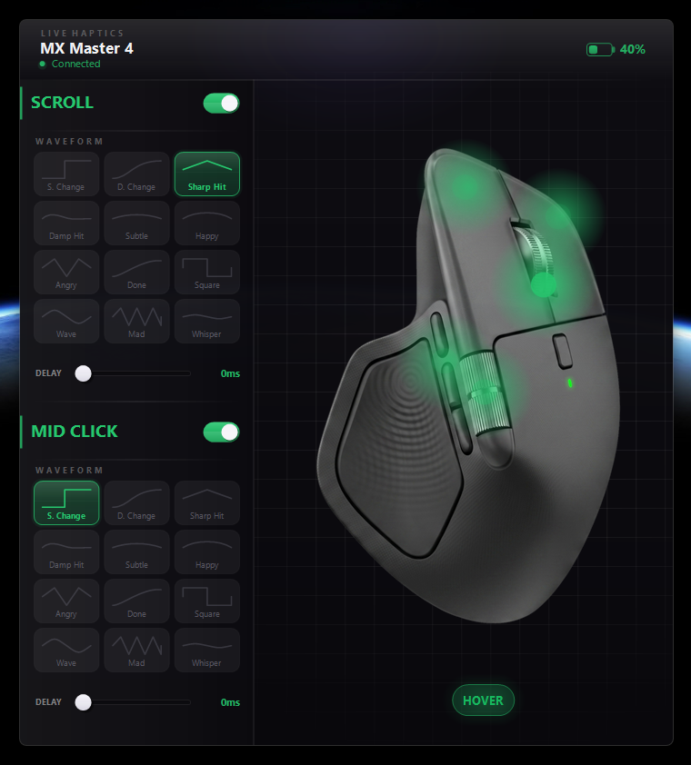

# Live Haptics

Vibe coded Live Haptics with Claude Code. It is a Windows system tray application that adds customizable haptic feedback to your Logitech mouse (such as the MX Master 4). By directly communicating with the mouse via the HID++ protocol, it allows you to configure specific haptic waveforms for various mouse events, creating a more tactile user experience.

## Features

- **Custom Haptic Waveforms**: Choose from a variety of haptic effects (Click, Snap, Knock, Pulse, etc.) for different mouse actions.
- **Event Support**: Configure haptics independently for:
  - Vertical Scroll
  - Side/Thumb Scroll
  - Left Click
  - Right Click
  - Side Buttons (Forward/Back)
  - Hover (UI elements, window controls)
- **Granular Control**: Adjust the delay (cooldown) between haptic events to prevent overwhelming feedback.
- **Hover Detection**: Utilizes UIAutomation and MSAA to detect when the cursor hovers over interactive elements (buttons, links, text fields) and provides tactile feedback.
- **System Tray Integration**: Runs quietly in the background with a clean, dark-mode popup interface for quick adjustments.
- **Battery Monitoring**: View your mouse's battery percentage directly from the system tray icon or the configuration popup.
- **Automatic Device Discovery**: Seamlessly detects and connects to your Logitech device via Bolt or Unifying receivers.

## Requirements

- Windows 10 or Windows 11
- A compatible Logitech mouse with haptic support (e.g., MX Master 4)
- CMake 3.20 or newer (for building)
- Visual Studio / MSVC Compiler (for building)

## Usage

1. Run `LiveHaptics.exe`.
2. The application will start and place an icon in your system tray (bottom right corner of your screen).
   - A **Green** dot indicates your mouse is connected and supported.
   - A **Yellow/Red** dot indicates low battery.
   - A **Gray** dot indicates the device is disconnected.
3. Click the system tray icon to open the configuration popup.
4. Toggle different features on/off, select the desired haptic waveform, and adjust the delay to suit your preference.
5. Settings are automatically saved to your `AppData/Roaming/LiveHaptics/config.ini` file.